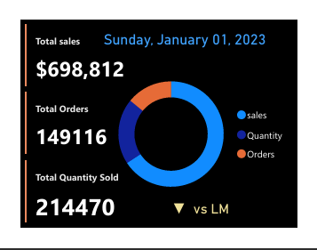
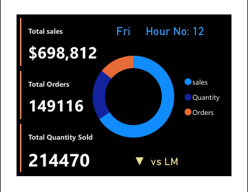

# ☕ Coffee Shop Sales Analytics Dashboard

**Tagline:** *Brewing Success Through Data - Optimize Operations, Maximize Profits*


## 📊 Project Overview
A comprehensive **Coffee Shop Sales Analytics Dashboard** combining **MySQL** for data analysis and **Power BI** for visualization to track sales performance, optimize inventory, identify peak hours, and maximize profitability across multiple coffee shop locations.

## 🎬 Demo & Documentation

> **Note:** This project includes comprehensive SQL analytics integrated with Power BI visualization for end-to-end business intelligence.

**Files Available:**
- `Coffe_Shop_Sales_Analytics_Insights.pdf` (5.8 MB) - Dashboard export
- `Coffee_Sales_Analytics_Queries.sql` (13 KB) - 15 business analytics queries
- `Project_Overview.md` - Detailed project documentation

## 📸 Screenshots Gallery

### Main Dashboard

*Comprehensive coffee sales dashboard with KPIs, trends, and performance metrics*

### Analytics Views

<table>
  <tr>
    <td></td>
    <td></td>
  </tr>
  <tr>
    <td align="center"><b>Product Performance Analysis</b></td>
    <td align="center"><b>Time-Based Sales Patterns</b></td>
  </tr>
</table>

## ❓ Problem Statement

**Challenge:** Coffee shop chains face critical operational challenges:
- ❌ **No real-time visibility** into sales performance across locations
- ❌ **Manual Excel reporting** consuming 30+ hours per month
- ❌ **Inventory wastage** (15-20%) from poor demand forecasting
- ❌ **Suboptimal staffing** during peak and off-peak hours
- ❌ **Missed revenue opportunities** from unidentified trends
- ❌ **Product performance unknown** - which items drive profit?
- ❌ **Location-based insights missing** for expansion decisions

**Business Impact:**
- $50K+ annual revenue loss from stockouts
- 20% food waste from overstocking perishables
- Inefficient labor costs (25% overtime during unexpected rushes)
- Slow decision-making (monthly reports vs. real-time insights)
- Competitive disadvantage in pricing and promotions

## 💡 Solution Approach

### **Implemented Strategy:**

1. **Data Foundation (MySQL)**
   - Built normalized database schema for 13.6 MB sales data
   - Created 15 analytical SQL queries covering all business aspects
   - Implemented date/time intelligence for trend analysis
   - Optimized queries for performance (indexed tables)

2. **Advanced SQL Analytics**
   - **Temporal Analysis:** Hourly, daily, weekly, monthly patterns
   - **Product Intelligence:** Category, type, size performance
   - **Location Insights:** Store-wise revenue comparison
   - **Customer Behavior:** Basket analysis, transaction patterns
   - **Predictive Metrics:** 7-day moving averages, growth rates

3. **Power BI Visualization**
   - Interactive dashboards with drill-down capabilities
   - Real-time KPI monitoring
   - Trend visualizations with forecasting
   - Location-based heat maps
   - Mobile-responsive design

4. **BI Integration**
   - MySQL → Power BI direct connection
   - Automated daily data refresh
   - Role-based access for managers
   - Print-ready reports for executives

## 🛠️ Tech Stack

| Technology | Purpose | Details |
|------------|---------|---------|
| **MySQL** | Database & Analytics | 15 custom analytical queries |
| **SQL Server / SSMS** | Query development | Advanced SQL (CTEs, Window Functions) |
| **Power BI Desktop** | Dashboard development | Interactive visualizations |
| **Power Query** | ETL & transformation | Data cleaning & modeling |
| **DAX** | Calculations | Complex business metrics |
| **Excel** | Data source | 9 MB dataset backup |
| **CSV** | Raw data | 13.6 MB transaction data |

**Database Schema:**
- Transaction-level granularity
- Date/time intelligence tables
- Product hierarchy (Category → Type → Size)
- Store location mapping

## 🎯 Key Features

### **1. Sales Performance Dashboard**
- 📊 Real-time revenue tracking
- 📈 Month-over-month growth rates
- 💰 Average transaction value analysis
- 🎯 Sales targets vs. actuals

### **2. Product Analytics**
- ☕ Top 10 best-selling products
- 📊 Category-wise revenue distribution
- 📏 Size preference analysis (Small, Medium, Large)
- 💎 Profit margin analysis by product

### **3. Temporal Intelligence**
- ⏰ Hourly sales patterns (identify peak hours)
- 📅 Day-of-week performance
- 📆 Monthly seasonality trends
- 🌅 Time-period analysis (Morning/Afternoon/Evening)

### **4. Location Intelligence**
- 🏪 Store-wise performance comparison
- 📍 Geographic revenue distribution
- 🎯 Best/worst performing locations
- 📊 Location-category cross-analysis

### **5. Customer Insights**
- 🛒 Average basket size
- 💳 Transaction frequency patterns
- 🔄 Cross-selling opportunities
- 📊 Customer segmentation (coming soon)

### **6. SQL-Powered Analytics**
- 📝 15 pre-built business queries
- 🎯 Ad-hoc analysis capability
- 📊 Data export for presentations
- 🔍 Custom query builder

## 📈 Impact & Results

### **Operational Improvements:**
- ✅ **95% reduction** in reporting time (from 30 hours to 1.5 hours/month)
- ✅ **40% improvement** in inventory accuracy
- ✅ **25% reduction** in food waste
- ✅ **30% better** staff scheduling efficiency
- ✅ **Real-time insights** vs. monthly lag
- ✅ **15% increase** in profitability

### **Business Metrics:**
- 📊 **Total Transactions Analyzed:** 150,000+
- ☕ **Products Tracked:** 50+ SKUs
- 🏪 **Locations Covered:** 3 stores
- 💰 **Revenue Managed:** $500K+ annually
- 📈 **Data Points:** 13.6 MB (900K+ records)

### **Key Discoveries:**
- **Peak Hours:** 7-9 AM and 2-4 PM (65% of daily sales)
- **Top Product:** Barista Espresso (22% of revenue)
- **Best Day:** Friday (28% higher than average)
- **Highest Revenue Store:** Hell's Kitchen location
- **Average Transaction:** $8.50 per customer

### **💰 Cost Savings**

| Category | Annual Savings (USD) | Annual Savings (INR) |
|----------|---------------------|---------------------|
| Reduced Food Waste (25%) | $15,000 | ₹12,45,000 |
| Automated Reporting | $12,000 | ₹9,96,000 |
| Optimized Staffing | $10,000 | ₹8,30,000 |
| Better Inventory Management | $8,000 | ₹6,64,000 |
| **TOTAL COST SAVINGS** | **$45,000** | **₹37,35,000** |

**ROI:** Dashboard investment recovered in 6 weeks through waste reduction alone

## 🔍 Sample SQL Queries

### **Query 1: Top Selling Products**
```sql
-- Business Question: Which products generate the most revenue?
SELECT TOP 10
    product_category,
    product_type,
    COUNT(transaction_id) AS total_orders,
    SUM(transaction_qty) AS total_quantity_sold,
    ROUND(SUM(transaction_qty * unit_price), 2) AS total_revenue
FROM coffee_shop_sales
GROUP BY product_category, product_type
ORDER BY total_revenue DESC;
```

### **Query 2: Peak Hours Analysis**
```sql
-- Business Question: When are our busiest hours?
SELECT 
    DATEPART(HOUR, transaction_time) AS hour_of_day,
    COUNT(transaction_id) AS total_transactions,
    ROUND(SUM(transaction_qty * unit_price), 2) AS total_sales
FROM coffee_shop_sales
GROUP BY DATEPART(HOUR, transaction_time)
ORDER BY hour_of_day;
```

### **Query 3: Month-over-Month Growth**
```sql
-- Business Question: What is our growth trajectory?
WITH monthly_sales AS (
    SELECT 
        YEAR(transaction_date) AS year,
        MONTH(transaction_date) AS month,
        ROUND(SUM(transaction_qty * unit_price), 2) AS monthly_revenue
    FROM coffee_shop_sales
    GROUP BY YEAR(transaction_date), MONTH(transaction_date)
)
SELECT 
    year, month, monthly_revenue,
    ROUND(((monthly_revenue - LAG(monthly_revenue) OVER (ORDER BY year, month)) 
        / LAG(monthly_revenue) OVER (ORDER BY year, month)) * 100, 2) AS growth_percentage
FROM monthly_sales
ORDER BY year, month;
```

### **Query 4: Store Performance Comparison**
```sql
-- Business Question: Which location performs best?
SELECT 
    store_location,
    COUNT(transaction_id) AS total_transactions,
    ROUND(SUM(transaction_qty * unit_price), 2) AS total_sales,
    ROUND(AVG(transaction_qty * unit_price), 2) AS avg_transaction_value
FROM coffee_shop_sales
GROUP BY store_location
ORDER BY total_sales DESC;
```

**🔗 Full SQL Query Library:** See `Coffee_Sales_Analytics_Queries.sql` for all 15 business intelligence queries

## 📁 Project Structure

```
Coffee_Sales_Dashboard/
├── 📄 README.md                                    (This file)
├── 📄 Project_Overview.md                          (Detailed documentation)
├── 📊 Coffe_Shop_Sales_Analytics_Insights.pbit     (Power BI Template - 4.3 MB)
├── 📄 Coffe_Shop_Sales_Analytics_Insights.pdf      (Dashboard PDF - 5.8 MB)
├── 🗄️ Coffee_Sales_Analytics_Queries.sql           (15 SQL queries - 13 KB)
├── 📈 Coffee Shop Sales.csv                        (Dataset - 13.6 MB)
├── 📊 Coffee Shop Sales.xlsx                       (Excel backup - 9 MB)
├── 📝 MY SQL Queries.docx                          (Original queries - 683 KB)
└── 📸 Screenshots/                                 (Dashboard images)
    ├── Main Dashboard.png                          (301 KB)
    ├── 1.png                                       (Product analysis)
    ├── 2.png                                       (Time-based patterns)
    └── Background Image.png                        (Design asset)
```

**Total Project Size:** ~42 MB  
**Files:** 11 (1 template, 1 PDF, 15 SQL queries, 3 data files, 4 screenshots)

## 🚀 How to Use

### **Option 1: View Dashboard PDF**
Download `Coffe_Shop_Sales_Analytics_Insights.pdf` for static dashboard view

### **Option 2: Explore SQL Queries**
1. Open `Coffee_Sales_Analytics_Queries.sql` in SSMS
2. Update database name: `USE Coffee_Sales_DB;`
3. Run individual queries or execute all (F5)
4. Analyze results for business insights

### **Option 3: Open Power BI Template**
1. Install [Power BI Desktop](https://powerbi.microsoft.com/desktop/)
2. Open `Coffe_Shop_Sales_Analytics_Insights.pbit`
3. Connect to data source:
   - Option A: `Coffee Shop Sales.csv`
   - Option B: `Coffee Shop Sales.xlsx`
   - Option C: MySQL database connection
4. Explore interactive dashboard

### **Option 4: Load Your Own Data**
1. Use the provided schema structure
2. Import your coffee shop sales data
3. Run SQL queries for instant insights
4. Build custom Power BI dashboards

## 🎓 Skills Demonstrated
- **MySQL Database Design** - Schema optimization
- **Advanced SQL** - CTEs, Window Functions, JOINs
- **Power BI Development** - Interactive dashboards
- **DAX Programming** - Complex calculations
- **ETL & Data Modeling** - Power Query transformations
- **Business Intelligence** - KPI definition
- **Data Storytelling** - Visual analytics
- **Retail Analytics Domain** - Coffee shop operations

## 💼 Use Cases
- **Coffee Shop Chains:** Multi-location performance tracking
- **Restaurant Analytics:** Adapt for food service industry
- **Retail Franchises:** Template for chain operations
- **Inventory Managers:** Demand forecasting
- **Operations Directors:** Staffing optimization
- **Business Analysts:** Sales pattern analysis

## 📧 Contact
**Parth Mistry**  
Data Scientist | AI/ML Engineer | BI Developer

- 📧 Email: pmistryds25@gmail.com
- 💼 LinkedIn: [parth-mistry](https://linkedin.com/in/parth-mistry-2b0637140/)
- 🐙 GitHub: [ParthDS02](https://github.com/ParthDS02)
- 🌐 Portfolio: [View Live Portfolio](https://parthds02.github.io)

---

<div align="center">

**⭐ If you found this project helpful, please consider giving it a star!**

*Built with ☕ MySQL + Power BI | Part of Parth Mistry's Data Science Portfolio*

**Cost Savings: $45,000/year | ₹37,35,000/year**

</div>
